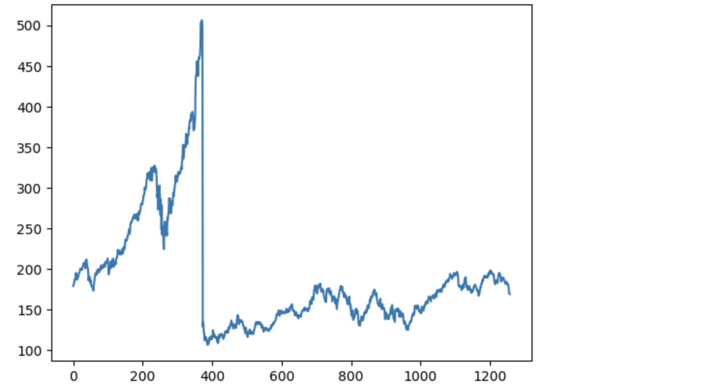
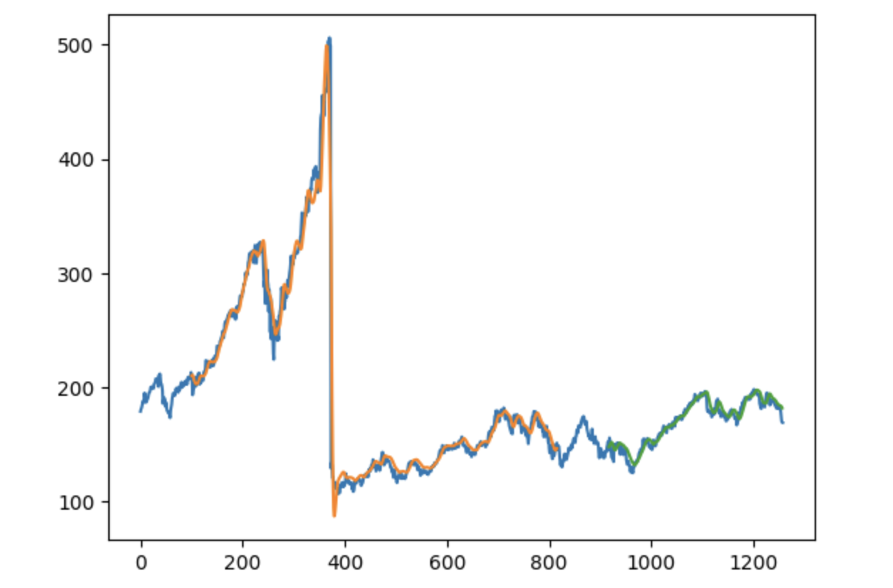
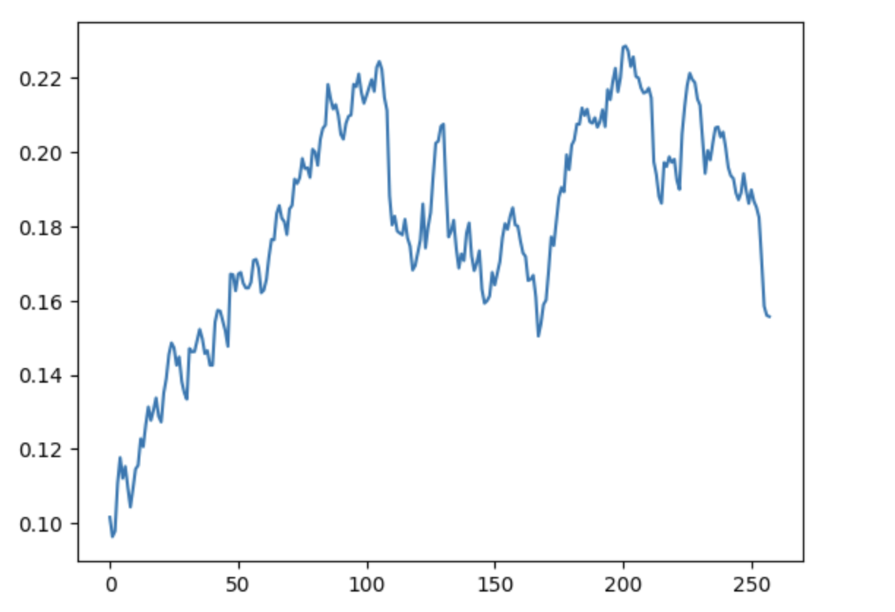

# 📈 Stock Price Prediction Using Stacked LSTM

A Deep Learning project that predicts future stock prices using a **Stacked Long Short-Term Memory (LSTM)** neural network. The model is trained on historical stock market data and forecasts future prices using time-series forecasting techniques.

---

## 🚀 Project Overview

This project demonstrates how Deep Learning can be applied to financial time-series forecasting.

The workflow includes:

- Data Collection
- Data Preprocessing
- Feature Scaling
- Sequence Generation
- Stacked LSTM Model
- Model Training
- Stock Price Prediction
- Future Forecasting
- Performance Evaluation

---

## 📂 Project Structure

```text
Stock-Price-Prediction-Using-Stacked-LSTM
│
├── Stock_Price_Prediction_Using_Stacked_LSTM.ipynb
├── README.md
├── requirements.txt
├── .gitignore
├── assets/

```

---

## 🛠️ Tech Stack

- Python
- TensorFlow
- Keras
- Pandas
- NumPy
- Scikit-Learn
- Matplotlib
- Jupyter Notebook

---

## 🧠 Model Architecture

The model uses a **Stacked LSTM** network to learn sequential dependencies in stock prices.

Workflow:

1. Load historical stock data
2. Normalize data using MinMaxScaler
3. Create sequences using a 100-day sliding window
4. Train a Stacked LSTM model
5. Predict stock prices
6. Forecast future stock prices

---

## 📊 Features

- Historical stock price analysis
- Data visualization
- MinMax normalization
- Time-series sequence generation
- Stacked LSTM implementation
- Future stock price forecasting
- Prediction vs Actual comparison

---

## 📈 Results

The trained model successfully captures the overall trend of stock prices and generates future forecasts using historical observations.

Evaluation Metrics:

- RMSE
- Prediction Visualization
- Future Forecast Plot

---

## 📷 Screenshots

### Prediction vs Actual



### Future Forecast




### Training Visualization




## ⚙️ Installation

Clone the repository

```bash
git clone https://github.com/arshit-0101/Stock-Price-Prediction-Using-Stacked-LSTM
```

Install dependencies

```bash
pip install -r requirements.txt
```

Launch Jupyter Notebook

```bash
jupyter notebook
```

Open

```
Stock_Price_Prediction_Using_Stacked_LSTM.ipynb
```

---

## 📌 Future Improvements

- Multi-stock prediction
- Hyperparameter tuning
- Transformer-based forecasting
- Interactive dashboard
- Real-time market data integration

---

## 👨‍💻 Author

**Arshit Goyal**

B.Tech, IIT Ropar

---

⭐ If you found this project useful, consider giving it a star.# Stock-Price-Prediction-Using-Stacked-LSTM
